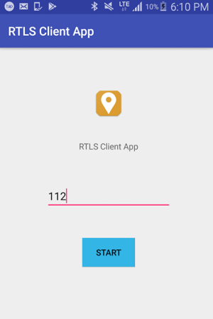
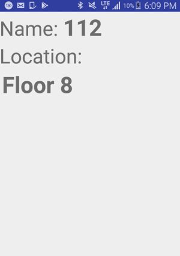

## Android-BLE-Reco2

Android + Socket.IO + Reco2 SDK to be used for RTLS BLE-based.

## Screenshots

  

## How to use

- Import into Android Studio
- Download Reco2 SDK from their official website
- Follow their manual on how to add the SDK into the project

## License

&copy; 2017 [Muhammad Syafrudin](https://justudin.com)

